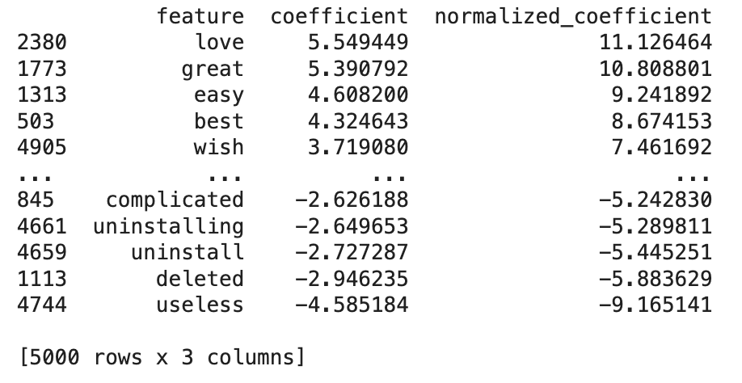
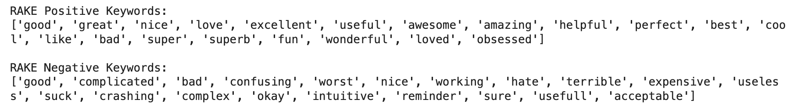
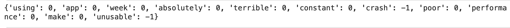
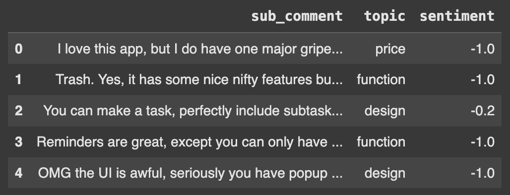

# AIPI540 A2

# AIPI540 A2

Analyzing customer reviews represent a significant aspect of every marketing / tech support team. However, they do not necessarily give the most informative info. In particular, there may be a part of the sentence that has a relatively positive sentiment but another part could be relatively negative. Furthermore, there may be cases where multiple topics are included in a particular review. It thus becomes a necessity to map the sentiment and topic to specific parts of the sentence. 

For instance, a review may be "I like how easily this app makes tracking my daily healh habits but not a fan of the increased monthly subscription cost". Obviously, the first part represents a positive review for the app features and the review turns negative for pricing. Traditional sentiment analysis may not be able to capture the nunace of customer reviews well enough. 

How to assign the sentiment score and topics to sentences chunks are the main subjects of exploration for this project. 

## Scripting (Harshitha) 
We first selected app on google play store that are long-standing, and new apps. Newer companies were also represented. Apps with a good amount of were selected. 
A total of 40 apps were made and stored in a json file. 

## Naive approach
Used a naive bayes to predict the sentiment of a whole sentence. Because 

## Classical Machine Learning Approach (Harshitha and Harry) 
Initially, we tried clustering, which was to assign a probability to each different cluster it identified. This unsupervised learning appraoch made sense since we had to make 
A downside to this approach was that we had to manually decide which cluster it was, leading to some subjectivity. It was also unclear how many clusters we would choose. 
However, this approach gave us some ideas on what topics we need to assign. Eventually we settled with the following topics: 
['price', 'function', 'design', 'customer service', 'other', 'quality', 'security', 'overall']

Then, we used a logistic regression model to obtain the coefficients for keys words, as shown below: 



We also used the Rake model to obtain key words, with built-in extraction function, as shown below: 



We did some cleaning, such as lower casing, removing stop words, removing punctuations, and stemming. 

We then compared each word to the list of positive and negative words obtained from above and generated cosine similarity scores. For each word in a new sentence, we converted it into a word vector with a word2vec model, and made cosine similarity score with both the mean vector representation of both the positive word list and the negative word list (centroid vector). Then, we subtacted the negative similarity score from the positive similarity score to a get a final similarity metric. If this number is greater than a threshold (0.5), it is marked positive, otherwise negative. 

The output looks like:


Finally, with the key words being marked, we then color code the words and made a html file to visually display the sentiment analysis. 

## Deep Learning (Dave and XiaoQuan) 

We designed a prompt template for the LLM to parse the input text and output a JSON format. An example would look like this:

  {{
      "sub_comment": "I love this app",
      "topic": "quality",
      "sentiment": 1
  }},
  {{
      "sub_comment": ", but the price is too high.",
      "topic": "price",
      "sentiment": -1
  }}

Then, a python function is written to process the dataframe into a more legible format, with new columns "sub_comment", "topic", and "sentiment" to represent the corresponding information. 

## Evaluation 
As a quality check, the eval_model.py script evaluates the quality of model performance for multi-label topic classification with per-topic sentiment scores. It returns a python dictionary of evaluation metrics like Topic_Precision, Topic_F1, and Topic_Recall for topic classification and sentiment_MSE for sentiment scoring. A Topic_Sentiment_Coverage metric is also included.



We used BERT model to conduct both inferences on classification (assigning topic) and regression (predicting sentiment score) to each partial sentence. 

With the subsentence, we then added self-attention masks, trauncation, and padding to faciliate the model training. We removed stop words, stemmed words into their root forms, and made lower case for the words before tokenizing the words. BertTokenizerFast is the model for tokenization. 

We then split the data into train, val, and test sets for final evaluation. 

During training, we split the train dataset into batched to be passed into the BERT model, along with the self-attention masks, sentiment scores, topic, and sentiment_loss
For training the multi-classification, we used accuracy because we care equally about all the topics, not one particular class or imbalanced cases. The outputs are topic_logits, which then passes through a softmax function to map into proababilities for each topic class.

For training the scoring, we evaluated with RSME. It represents how accurate the model is at scoring by taking the root of the sum of squared errors. 

## Front End
A streamlit front end is made to demo our project details. We make sure to add coloring effect to the front end design such that we are also capable of making 


## install dependencies

```bash
pip install -r requirements.txt
```

## Data Preprocessing

By running the following command, the data will be preprocessed and saved to `models/data/processed_data.csv`.

```bash
python scripts/preprocess_data.py
```

To check the quality of the processed data, run the following command:

```bash
python scripts/check_label_quality.py
```
